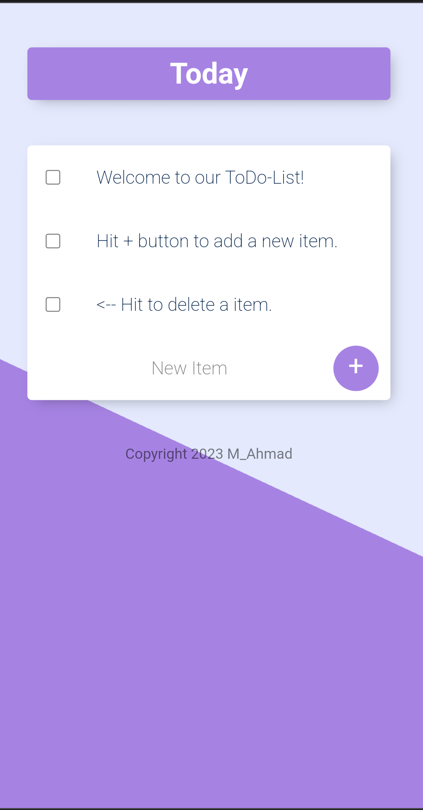

# My To-Do List App

Welcome to My To-Do List App! This app helps you stay organized by managing your tasks efficiently. It has a user-friendly interface, supports task creation, editing, and completion, and utilizes a backend powered by Node.js, Express, and MongoDB.

## Features

- **Task Creation**: Easily add tasks with titles, descriptions, due dates, and priority levels.
- **Task List**: View all your tasks in a clean, organized list format.
- **Task Editing**: Edit or update tasks as your plans change.
- **Task Completion**: Mark tasks as completed and watch them move to the done list.
- **Sorting and Filtering**: Arrange tasks by priority or due date, and apply filters to focus on specific tasks.

## Getting Started

1. Clone this repository: `git clone https://github.com/your-username/to-do-list-app.git`
2. Navigate to the app directory: `cd to-do-list-app`
3. Install frontend dependencies: `npm install` or `yarn install`
4. Navigate to the backend directory: `cd backend`
5. Install backend dependencies: `npm install` or `yarn install`
6. Start the frontend: `npm start` or `yarn start`
7. Start the backend: `npm run server` or `yarn server`
8. Open your browser and go to `http://localhost:3000` to use the app.

## Backend Setup

1. Ensure you have MongoDB installed and running.
2. Create a `.env` file in the `backend` directory with your MongoDB connection string: `MONGODB_URI=your-mongodb-connection-string`

## Technologies Used

- Frontend: HTML, CSS, JavaScript
- Backend: Node.js, Express, MongoDB, Mongoose
- Templating Engine: EJS

## Contributing

Contributions are welcome! If you find any issues or have ideas for improvements, please submit a pull request. 

---

Feel free to customize this `Readme.md` to match your app's specific details and additional features.
